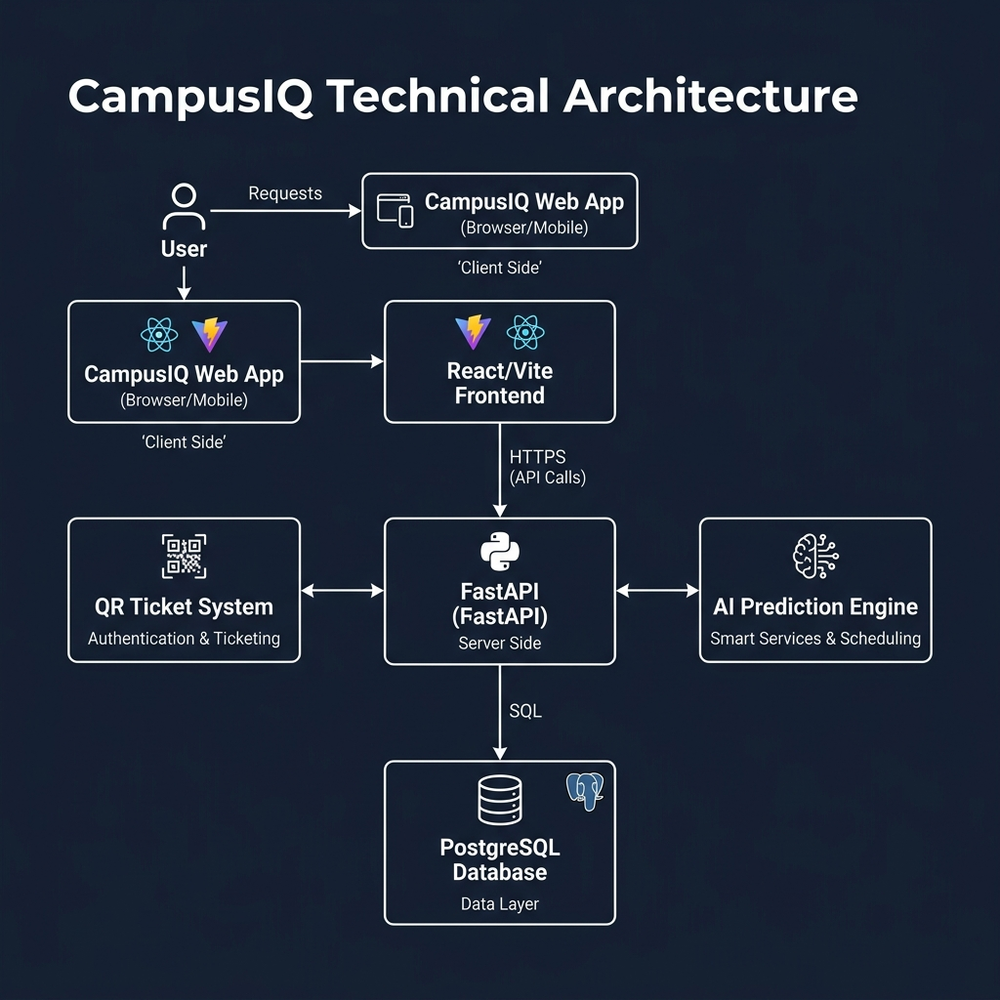

# CampusIQ 🎓 - Smart Campus Event Management System

CampusIQ is a premium, full-stack platform designed to revolutionize campus event management. It provides a seamless experience for students to discover events, hosts to manage them with AI-driven insights, and volunteers to verify attendance using a robust QR-based ticketing system.


- [Features](#-features)
- [Tech Stack](#-tech-stack)
- [Architecture](#-architecture)
- [Local Setup](#-local-setup)
- [User Roles](#-user-roles)
- [AI & Prediction](#-ai--prediction)
- [Future Scope](#-future-scope)
- [Screenshots](#-screenshots)

---

## 🚀 Features

### 🔐 Multi-Role Authentication
- Secure JWT-based authentication.
- Dedicated dashboards for **Students**, **Hosts**, and **Volunteers**.
- Role-based access control (RBAC).

### 📅 Event Management (For Hosts)
- **Create & Edit**: Rich event creation with posters, descriptions, and participant limits.
- **Analytics Dashboard**: Real-time stats on registrations and attendance.
- **AI Predictions**: Integrated ML models to predict expected attendance based on event metrics.

### 🎟️ Smart Ticketing (For Students)
- **Instant Booking**: One-click registration for campus events.
- **QR Generation**: Automatic generation of unique, secure QR tickets stored locally and in the database.
- **Event Discovery**: Dynamic list of upcoming events with real-time updates.

### 🔍 Attendance Verification (For Volunteers)
- **In-Browser Scanner**: High-performance QR scanner built with `html5-qrcode`.
- **Instant Validation**: Real-time ticket verification and attendance marking.
- **Anti-Fraud**: Prevents duplicate entries or invalid ticket usage.

---

## 🛠️ Tech Stack

### Frontend
- **Framework**: React 19 (Vite)
- **Styling**: TailwindCSS & Lucide icons
- **State/Routing**: React Router 7
- **API Client**: Axios
- **Scanning**: html5-qrcode

### Backend
- **Framework**: FastAPI (Python 3.10+)
- **Database**: PostgreSQL / SQLite (SQLAlchemy ORM)
- **Security**: JWT tokens, Passlib (Bcrypt)
- **Utilities**: Qrcode (generation), Pillow (image handling)

### AI / ML
- **Library**: Scikit-Learn
- **Model**: Linear Regression for attendance prediction
- **Storage**: Joblib

---

## 🏗️ Architecture



The system follows a modern decoupled architecture:
- **Frontend**: React-based Single Page Application (SPA) providing a responsive user interface.
- **Backend**: FastAPI REST server handling business logic, authentication, and AI processing.
- **Database**: Persistent storage for user data, events, and ticket records.
- **AI Engine**: Integrated predictions for event attendance analytics.
- **Ticket System**: Automated QR code generation and verification pipeline.

---

## 💻 Local Setup

Follow these steps to get CampusIQ running on your local machine.

### 1. Clone the Repository
```bash
git clone https://github.com/harshit-033/Campus_IQ.git
cd Campus_IQ
```

### 2. Backend Setup
Go to the `backend` directory and set up a virtual environment.

```bash
cd backend
python -m venv venv
# Windows
venv\Scripts\activate
# Linux/macOS
source venv/bin/activate

pip install -r requirements.txt
```

**Database Initialization:**
By default, the system uses a SQLite file (`test.db`) for development. To initialize a Postgres database, update `database.py` with your credentials.

**Run the Server:**
```bash
uvicorn main:app --reload
```
The backend will be available at `http://127.0.0.1:8000`.

### 3. Frontend Setup
Open a new terminal and go to the `frontend` directory.

```bash
cd frontend
npm install
```

**Environment Config:**
Create a `.env` file in the `frontend` folder:
```env
VITE_API_BASE_URL=http://127.0.0.1:8000
```

**Run the Frontend:**
```bash
npm run dev
```
The app will be available at `http://localhost:5173`.

---

## 👥 User Roles

| Role | Permissions | Key Features |
| :--- | :--- | :--- |
| **Student** | Browse, Register | QR Tickets, Event History, My Account |
| **Host** | Create, Manage, Analyze | AI Attendance Prediction, Poster Upload, Real-time Stats |
| **Volunteer** | Scan, Verify | QR Scanner, Attendance Marking, Validations |

---

## 🧠 AI & Prediction

CampusIQ uses a **Linear Regression** model to assist hosts in planning.
- **Inputs**: Participant limit, Event fee, Total registrations.
- **Output**: Predicted actual attendance.
- **Goal**: Helps organizers optimize resources like seating, catering, and venue size.

---

## 🔮 Future Scope

- [ ] **Automated Certificates**: Generate and email participation certificates (PDF) instantly after the event.
- [ ] **Payment Gateway**: Integration for paid workshops and high-value events.
- [ ] **Push Notifications**: Real-time reminders for upcoming events via Web Push or Email.
- [ ] **Mobile App**: Dedicated Android/iOS app for better scanning performance.
- [ ] **Live Dashboards**: Interactive charts (Recharts) for deeper event analytics.
- [ ] **Multi-Campus Support**: Scale the platform to support multiple institutions simultaneously.

---

## 🤝 Contributing

Contributions are welcome! Please feel free to submit a Pull Request.

1. Fork the Project
2. Create your Feature Branch (`git checkout -b feature/AmazingFeature`)
3. Commit your Changes (`git commit -m 'Add some AmazingFeature'`)
4. Push to the Branch (`git push origin feature/AmazingFeature`)
5. Open a Pull Request

---

## 📜 License

Distributed under the MIT License. See `LICENSE` for more information.

---

**Built with ❤️ for the Campus Community.**
